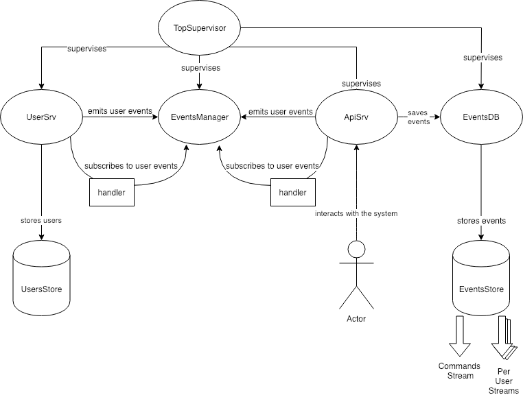
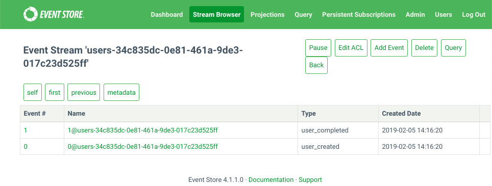
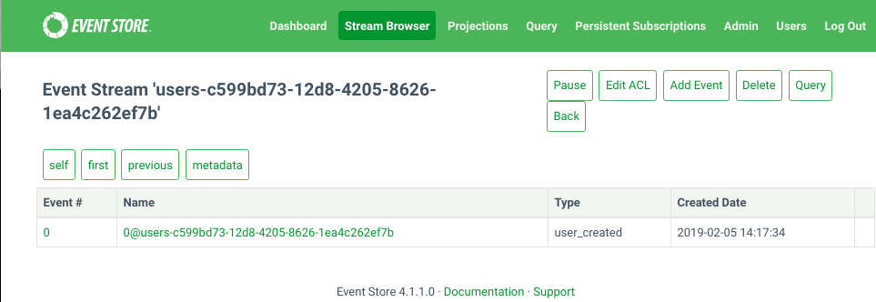

# es

## Overview

Sample event-based system to manage users based on the following rules:
1. A user can be either complete or incomplete.
  * a complete user has all its fields set
    ```erlang
    -record(es_user, {
                      id = erlang:error({required, id}) :: id(),
                      name :: string() | binary(),
                      surname :: string() | binary(),
                      age :: non_neg_integer(),
                      is_complete = false :: boolean()
                      }).

    ```
1. Only when user gets completed it is persisted
  * an incomplete user is kept in RAM and lost on restart
1. All the events in the system are persisted to an event databases backed
   by [EventStore](https://eventstore.org)
  * there's a stream for commands sent to the system (e.g. `create_user`)
  * there's a stream of events for each user (e.g. `user_created`); it's named
    is made of a `users-` prefix and a user ID (e.g. `<<"users-c599bd73-12d8-4205-8626-1ea4c262ef7b">>`)

## Architecture



## Example

In the system shell:
```
make
make shell
```

In the Erlang shell:

```erlang
%% create a complete user
Params = [{name, <<"szymon">>}, {surname, "mentel"}, {age, 38}].
{ok, Id}= es_api_srv:create_user(Params).
%% {ok,<<"34c835dc-0e81-461a-9de3-017c23d525ff">>}
es_events_db:read_backward_from_last(<<"users-", Id/binary>>, 10).
%% {ok,[{{event,<<"users-34c835dc-0e81-461a-9de3-017c23d525ff">>,
%%              1,
%%              <<1,185,245,171,211,213,69,167,170,135,108,241,121,80,215,
%%                29>>,
%%              <<"user_completed">>,
%%              <<131,104,3,100,0,5,101,118,101,110,116,104,2,103,100,0,
%%                13,110,111,...>>,
%%              <<>>},
%%       1},
%%      {{event,<<"users-34c835dc-0e81-461a-9de3-017c23d525ff">>,0,
%%              <<193,199,7,237,60,225,67,20,176,28,229,67,186,236,40,171>>,
%%              <<"user_created">>,
%%              <<131,104,3,100,0,5,101,118,101,110,116,104,2,103,100,0,
%%                13,110,...>>,
%%              <<>>},
%%       0}],
%%     -1,true}

%% create an incomplete user
IncompleteParams = tl(Params).
%% [{surname,"mentel"},{age,38}]
{ok, Id2} = es_api_srv:create_user(IncompleteParams).
%% {ok,<<"c599bd73-12d8-4205-8626-1ea4c262ef7b">>}
es_events_db:read_backward_from_last(<<"users-", Id2/binary>>, 10).
%% {ok,[{{event,<<"users-c599bd73-12d8-4205-8626-1ea4c262ef7b">>,
%%              0,
%%              <<143,10,30,232,248,109,66,79,133,49,98,113,136,93,78,171>>,
%%              <<"user_created">>,
%%              <<131,104,3,100,0,5,101,118,101,110,116,104,2,103,100,0,
%%                13,110,111,...>>,
%%              <<>>},
%%       0}],
%%     -1,true}
```

Then in the event store web UI we can see the complete user:



and the incomplete one:


